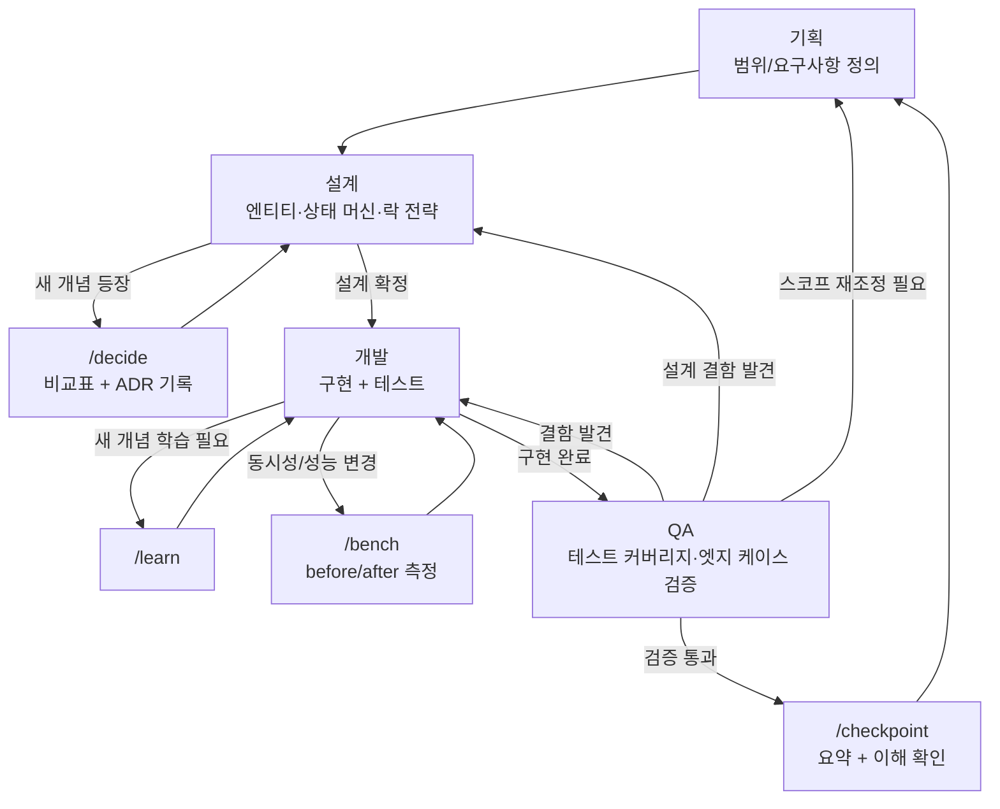

# 에이전트 워크플로

이 프로젝트는 작업 성격에 따라 4개의 역할로 나눠 진행한다. 각 역할은
`.claude/agents/`에 실행 가능한 서브에이전트로 정의되어 있고, `Agent` 도구로
`subagent_type`을 지정해 호출한다.

| 역할 | 에이전트 파일 | 책임 | 주로 쓰는 도구/커맨드 |
|---|---|---|---|
| 기획 | `.claude/agents/planner.md` | 작업 범위 정의, "지금 만들 것 vs 나중에 열어둘 것" 결정 | 읽기 전용 |
| 설계 | `.claude/agents/architect.md` | 새 개념(락 전략, 상태 머신 등) 후보안 비교, ADR 기록 | `/decide`, `docs/decisions.md` |
| 개발 | `.claude/agents/developer.md` | 엔티티/서비스/API 구현 + 테스트 | `/learn`, `/bench` |
| QA | `.claude/agents/qa.md` | 테스트 커버리지·엣지 케이스 검증, 회귀 확인 | `Bash`(테스트 실행) |

## 흐름

## 역할 간 경계

- **기획 → 설계**: 기획은 "무엇을, 어디까지" 만 정한다. "어떻게"(락 전략, 엔티티 구조)는
  설계의 몫이다.
- **설계 → 개발**: 설계는 후보안 비교와 결정까지만 하고, 실제 서비스/컨트롤러/리포지토리
  코드는 작성하지 않는다. 결정 없이 개발이 먼저 진행되지 않도록 막는 것이 설계의 역할이다.
- **개발 → QA**: 개발은 자신이 작성한 테스트로 "동작함"을 보장하고, QA는 개발자가
  놓쳤을 엣지 케이스와 회귀를 별도 시각에서 검증한다.
- **QA → 기획/설계/개발**: QA가 찾은 문제의 성격에 따라 되돌아갈 곳이 다르다 — 구현
  버그는 개발로, 설계 자체의 허점은 설계로, 애초에 범위 설정이 잘못됐다면 기획으로.

이 구조는 CLAUDE.md의 행동 원칙(특히 원칙 1·2·3)을 역할별로 강제하기 위한 것이다.
설계 에이전트가 "새 개념은 비교표 먼저"를, QA 에이전트가 "테스트 없이 완료 아님"을
각자의 책임 범위 안에서 담당한다.

## 세션 스코프 컨벤션 (2026-09-15)

Phase 1~3을 거치며 킥오프 프롬프트가 "VARCHAR 마이그레이션 하나", "gap lock 테스트 하나"처럼
지나치게 잘게 쪼개졌다 — 매 세션마다 이전 세션의 PR 상태·결정 사항을 다시 확인하는 오버헤드가
누적됐다. 그래서 앞으로는:

- **세션의 주제(스코프)는 모듈 단위로 잡는다** — 예: "이번 세션은 Purchase 모듈", "이번 세션은
  Product 모듈". 킥오프 프롬프트도 이 단위로 작성한다.
- **단, 세션 내부의 실제 커밋/체크포인트 단위는 그대로 유지한다** — CLAUDE.md 원칙 2(기능
  하나·테스트 하나 단위로 끊기)는 세션 스코프가 넓어져도 바뀌지 않는다. 한 세션 안에서도
  기능마다 커밋하고 `/checkpoint`로 끊어간다.
- **원칙 1 대상(새 개념/새 툴체인)은 모듈이 같아도 별도로 처리한다** — 예: autocannon 도입은
  Purchase 모듈에 속하지만 신규 툴체인이라 그 자체로 별도 `/decide`가 먼저 필요하다. "같은
  모듈이니 같이 진행"으로 원칙 1 절차를 건너뛰지 않는다.

즉 "무엇을 다룰 세션인가"는 넓게(모듈 단위), "무엇을 한 단위로 커밋·검증하는가"는 여전히
좁게(기능+테스트 단위) 가져간다.
